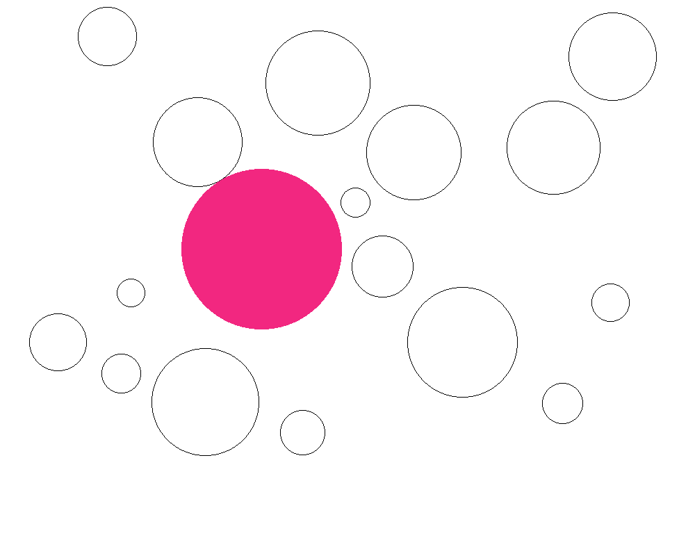
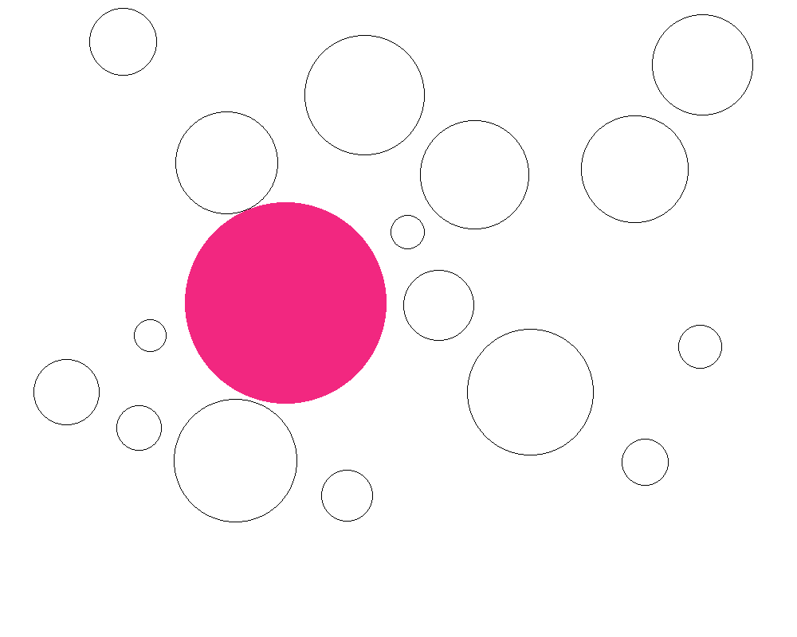
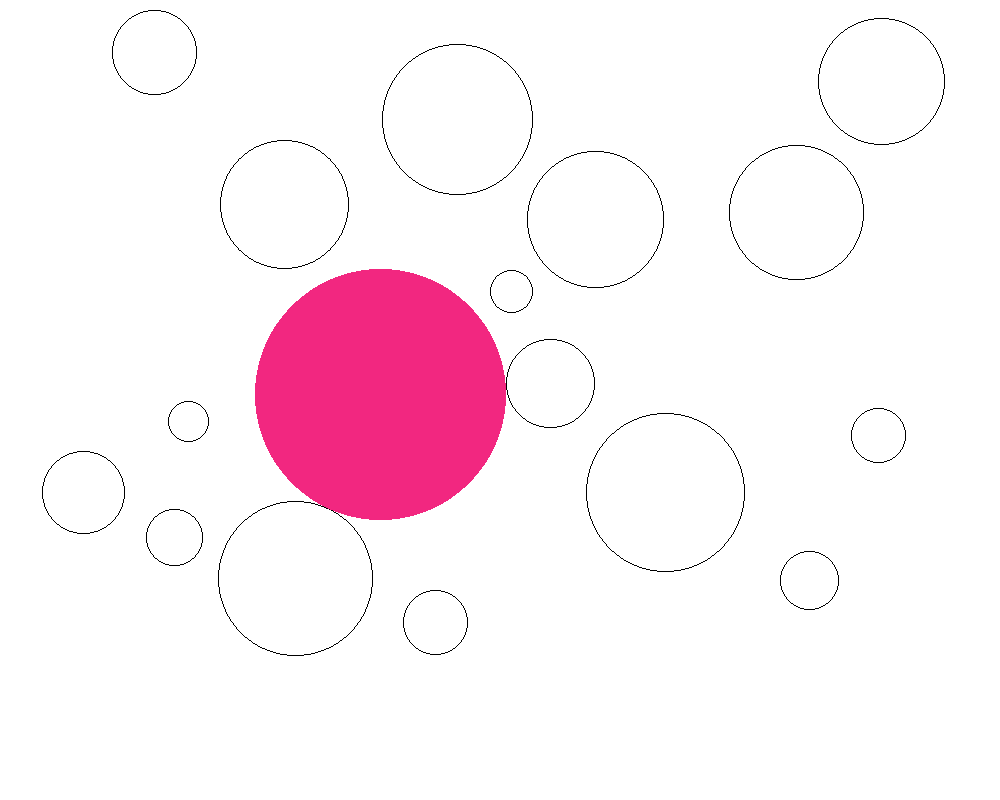
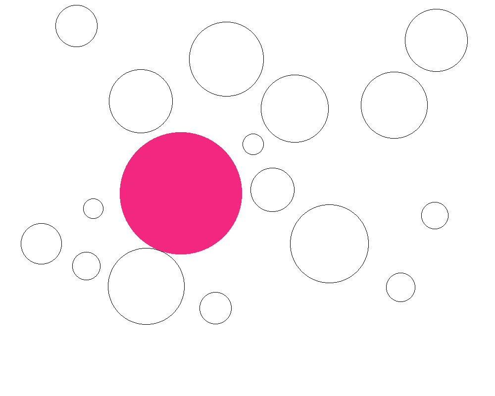
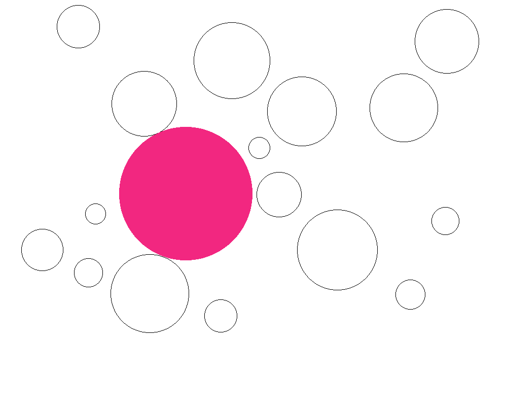
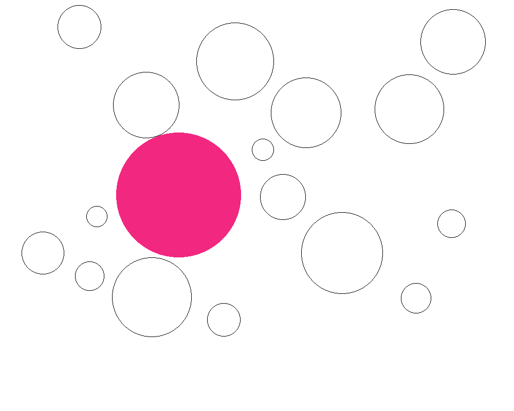
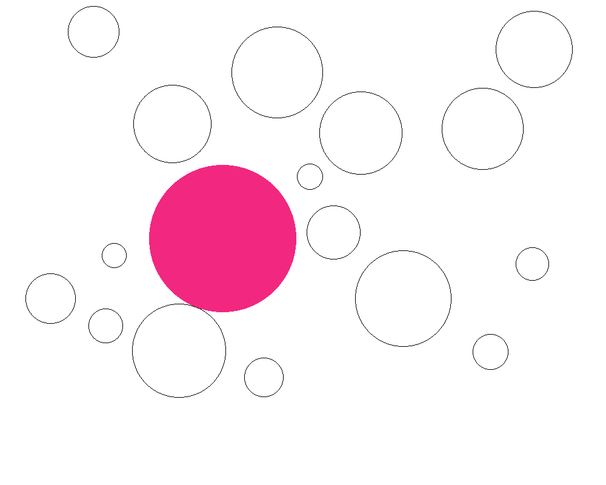
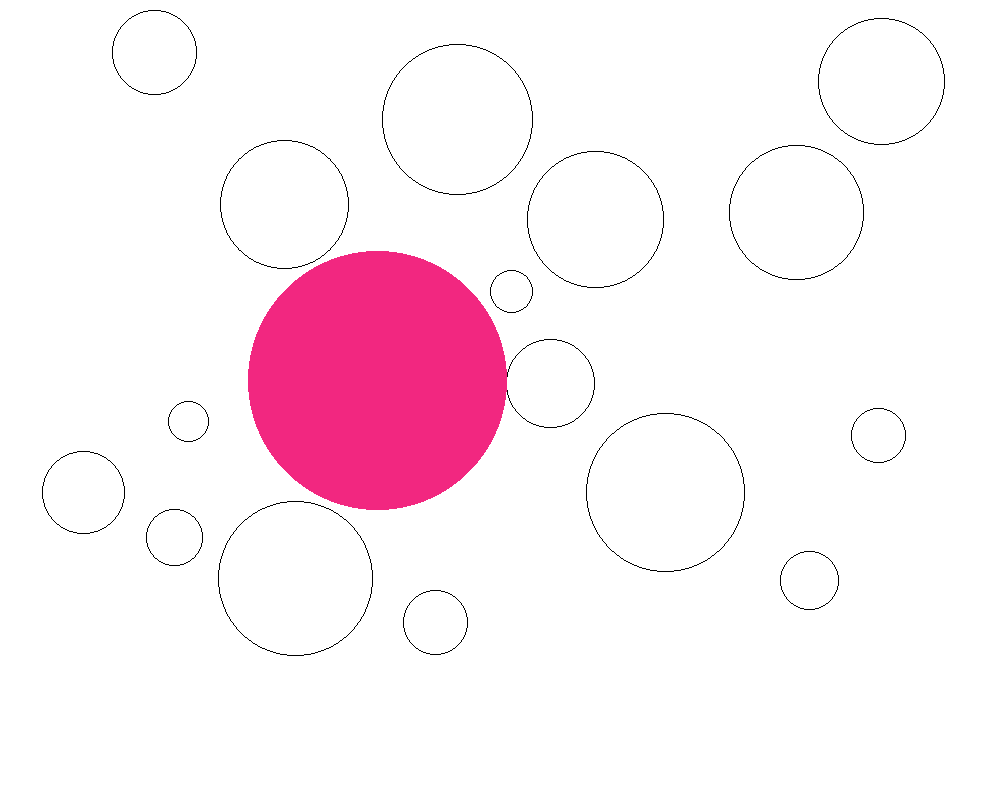
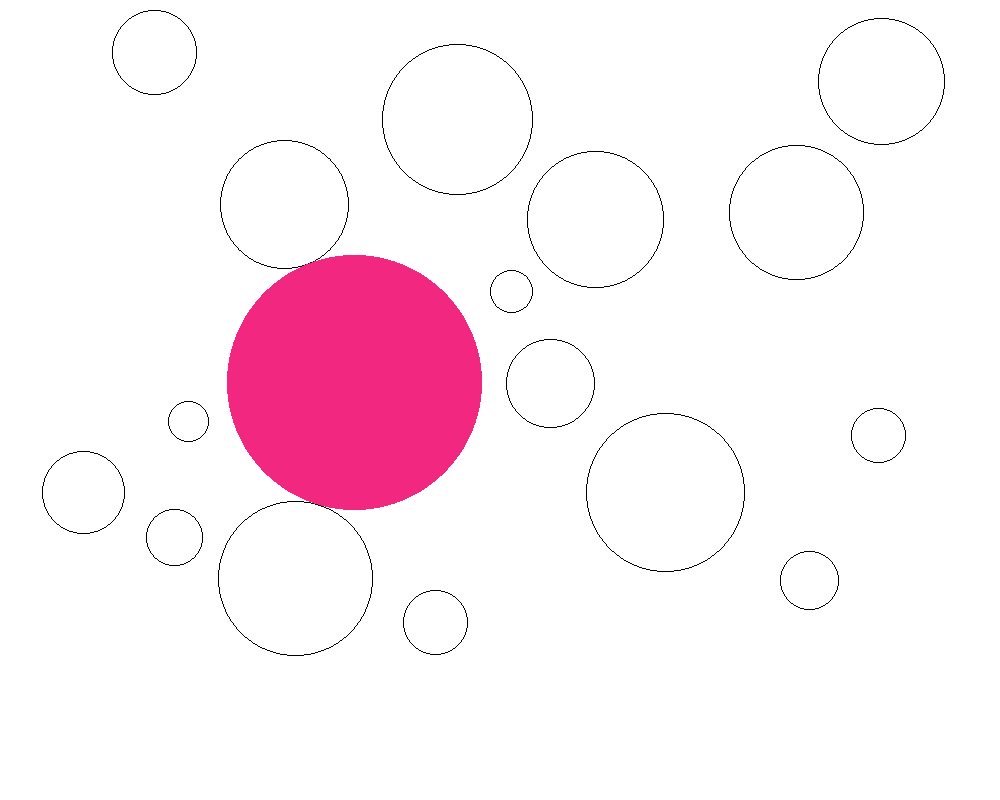

# Genetic Algorithm Biggest Circle Generator

**Circle Space:** Creates a canvas with a random amount of circles between 10-30, the coordinates and radius of the circles are also randomly generated. This canvas with circles is saved as a PNG file. The code also saves the info about each circle on a TXT file, that will later be read by the gen archive.

**Gen:** Uses a genetic algorith to fit the biggest circle possible in the blank spaces of the canvas without colliding with the other circles.

*Note:* The archives in the folders "circlespace" and "gen" are just the previous versions, the final files are *"circlespace4"* and *"gen5"*.

## Algoritmos Geneticos

Para el problema siguiente, haga:

1. Codifique un GA simple para resolver el problema. Para hacer esto, necesita codificar el problema, usar un cruce de un solo punto y un cambio de bits o una mutación de 2 opciones, usar una forma de selección de ruleta o selección de torneo, establecer un tamaño de población y seleccionar un criterio de parada.

2. Ejecute su GA.

3. Realice los siguientes cambios en su código GA (uno por uno) y compare el resultados.

    - Cambiar los puntos de partida iniciales (soluciones iniciales) diez veces
 
        - Run 1: Best Circle = (376, 358, 115), Fitness = 115
        - Run 2: Best Circle = (358, 380, 126), Fitness = 126
        - Run 3: Best Circle = (380, 394, 125), Fitness = 125
        - Run 4: Best Circle = (356, 381, 126), Fitness = 126
        - Run 5: Best Circle = (365, 390, 123), Fitness = 123
        - Run 6: Best Circle = (366, 381, 131), Fitness = 131
        - Run 7: Best Circle = (347, 379, 121), Fitness = 121
        - Run 8: Best Circle = (367, 393, 121), Fitness = 121
        - Run 9: Best Circle = (377, 380, 129), Fitness = 129
        - Run 10: Best Circle = (354, 382, 127), Fitness = 127

    - Cambiar la probabilidad de cruce dos veces

    - Cambiar la probabilidad de mutación dos veces
    - Cambiar el tamaño de la población dos veces
    - Cambie la semilla del número aleatorio diez veces
    - Incluya su código con su tarea.
    - Indique que el porcentaje de cada miembro del equipo contribuye a este asignación (solo si trabaja con otros).

4. No copie el trabajo de otro equipo/individuo. Cualquiera/cualquier equipo que viole este reglamento recibirá una calificación de cero para este taller.
Incluyo el óptimo global para cada problema como referencia, pero no lo use en su metodología de solución.

## Problema

Dada un área que tiene una cantidad de discos que no se superponen esparcidos por su superficie, como se muestra en la figura 1,

Utilice un algoritmo genético para encontrar el disco de mayor radio que se puede colocar entre estos discos sin superponer ninguno de ellos.  Ver figura 2.
